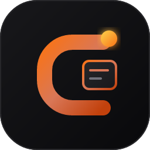

# Clauro

**A lightweight, local-first, BYOK desktop client for Claude.**

Native desktop. Single binary. No account, no telemetry.

---

> **This repository contains the specification and the application built from it.**
> 97 numbered decisions, the contracts every test hangs off, and 23
> contract-anchored tasks. Phase 0 (`Tasks/001`–`003`) is done: the sandbox
> verdict is recorded, the workspace is green in CI, and the keyring and
> model catalogue are live.

## Why read a spec instead of an app

The hard parts of this product are not features. They are guarantees, and a
guarantee that is not written down is a guarantee that quietly stops being
true. Every decision here carries a **D-number**, every type carries a
**contract**, and every task names the **failing test** that must exist before
any code is written.

A test that has never failed proves nothing. That rule is enforced, not
aspirational.

## The guarantees, in one place

| Claim | Why it is hard |
|---|---|
| Artifacts run in an **opaque origin** with no reachable path to app internals | A `<meta>` CSP is not a sandbox. `srcdoc` inherits the parent origin unless `sandbox` says otherwise. |
| **No artifact network egress** | CSP is the only enforcement point, and WebKitGTK/WebView2 differ on which directives they honour. Probed, not assumed. |
| **Nothing throws across the tool boundary** | A non-zero exit is `ok` with output attached, not an exception. Model-visible failure modes are a product surface. |
| **History is append-only** | The prefix guarantee only holds if history is never rewritten. Exactly four columns are mutable. |
| **API keys never reach SQLite** | Keychain only. `grep -ri 'api[_-]?key\s*='` must find nothing, and CI enforces it. |
| **No new dependency without a written rejection of the obvious alternative** | `TECH_STACK.md` §6. Dependency choice is a decision, not a convenience. |

## Platform status

Windows is primary and is where development happens. Linux is secondary.
macOS is deliberately out (**D49**, **D50**, **D88**, **D89**). One platform,
one toolchain, no cross-compilation.

Linux support is a **release blocker, not a warning** — a failure on the floor
CI job invalidates the sandbox guarantee on that platform.

## Read in this order

The authority order is fixed, and a later document never overrides an earlier
one without a new D-number.

| | |
|---|---|
| **Start here** | [`AGENTS.md`](AGENTS.md) — the document set and the rules that exist because we got them wrong |
| What this is, and what it is not | [`MISSION.md`](MISSION.md) |
| What must exist in v1 | [`SPEC.md`](SPEC.md) |
| Why each choice | [`DECISIONS.md`](DECISIONS.md) (**D1–D113**) |
| The shapes tests assert against | [`CONTRACTS.md`](CONTRACTS.md) |
| How it fits together | [`ARCHITECTURE.md`](ARCHITECTURE.md) |
| How it feels | [`DESIGN.md`](DESIGN.md) |
| What to build, in order | [`PHASES.md`](PHASES.md) · [`Tasks/`](Tasks/) |

## Status

`Tasks/001` — the dual-engine artifact sandbox spike — produced its verdict
(`docs/spikes/sandbox-verdict.md`). The **Windows/WebView2 half is verified**; the Linux/WebKitGTK
column is empty because the WebKitGTK probe app was never written, and per `AGENTS.md` §8a it stays
empty until someone runs it rather than being filled in by inference.

`Tasks/002`–`008` and `023` are implemented and their acceptance criteria are ticked with
`path:line` evidence in the task files. **What those ticks do not say is that the phase works
end to end** — `PHASES.md` §Progress is the honest view, including the four components that have full
test coverage and no caller outside their own tests, and the two CI floor jobs that are labels rather
than floors yet.

CI is live and does real work: the spec's own invariants
(`scripts/check-docs.py`), the platform matrix, an Aqua Trivy scan for
vulnerabilities, secrets and misconfiguration, a licence policy that fails the
build on GPL/AGPL drift, and an independent no-secrets gate. `main` and `dev`
are both protected: pull request required, one approving review, linear
history, no force push, no deletion.

Releases are cut by pushing a tag.

## Contributing

See [`CONTRIBUTING.md`](CONTRIBUTING.md). The short version: read `AGENTS.md`,
claim a task, write the failing test first, and never add a dependency without
a written reason.

## Licence

MIT. Ported designs are attributed in [`FEATURES.md`](FEATURES.md). Three MIT
projects were used as reference implementations; one non-open-source project was
read for observation only and nothing was taken from it (**D59**, **D60**).

## Security

Report vulnerabilities privately — see [`SECURITY.md`](SECURITY.md).
Do not open a public issue for a sandbox escape.